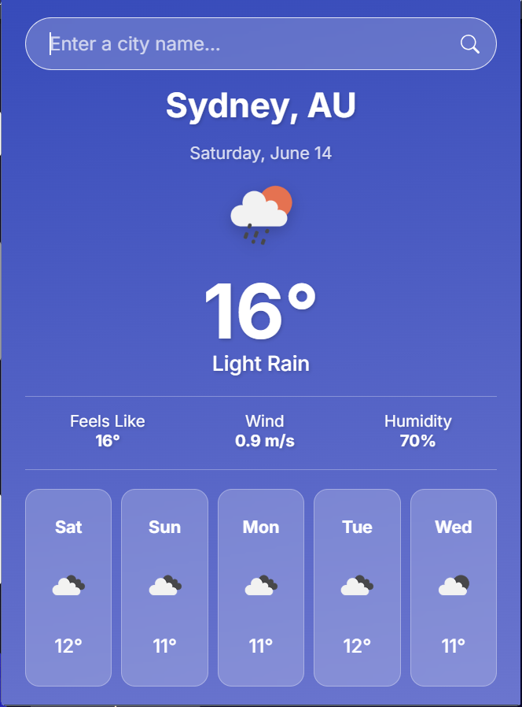

# Weather Dashboard Extension

 

A modern and visually appealing browser extension that provides the current weather and a 5-day forecast based on your current location. The interface features a clean, centered layout with a vibrant gradient background and "glassmorphism" effects for a premium user experience.

## Features

* **Automatic Geolocation:** Fetches weather data for your current location as soon as you open the extension.
* **Current Weather Details:** Displays a comprehensive summary of the current conditions, including:
    * City and Country
    * Current Date
<<<<<<< HEAD
    * Search functionality
=======
    * Search Funcion
>>>>>>> d7eb67de27c07d56b3c83ac86eb9740e63900d4e
    * An icon representing the weather (e.g., sunny, rainy, cloudy)
    * Temperature in Celsius
    * "Feels like" temperature
    * Wind speed
    * Humidity percentage
* **5-Day Forecast:** Shows the weather forecast for the next five days, with icons and temperatures for each day.
* **Modern UI:** A beautiful, centered interface with a colorful gradient background and easy-to-read text.

## Setup and Installation

Follow these steps to get the extension up and running in your browser.

### 1. Download the Code

Download all the project files (`popup.html`, `popup.css`, `popup.js`, `manifest.json`) and place them in a single folder on your computer.

### 2. Get an OpenWeatherMap API Key

This extension requires an API key from OpenWeatherMap to fetch weather data.

1.  Sign up for a free account at [https://openweathermap.org/api](https://openweathermap.org/api).
2.  After signing up, find your API key on your account page.

### 3. Add the API Key to the Project

1.  Open the `popup.js` file in a text editor.
2.  Find the line that says `const apiKey = '...';`
3.  Replace the placeholder key with your actual OpenWeatherMap API key.

    ```javascript
    // In popup.js
    const apiKey = 'YOUR_ACTUAL_API_KEY_HERE';
    ```

### 4. Load the Extension in Your Browser (Instructions for Google Chrome)

1.  Open Google Chrome and navigate to `chrome://extensions`.
2.  Enable the **"Developer mode"** toggle switch, usually found in the top-right corner.
3.  Click the **"Load unpacked"** button.
4.  Select the entire folder where you saved the project files.
5.  The Weather Dashboard Extension will now appear in your browser's toolbar!

## Technologies Used

* **HTML5:** For the structure of the extension popup.
* **CSS3:** For the custom styling, including the gradient background, layout, and glassmorphism effects.
* **JavaScript (ES6+):** For the application logic, including API calls and manipulating the DOM.
* **OpenWeatherMap API:** Used as the source for all weather and forecast data.

